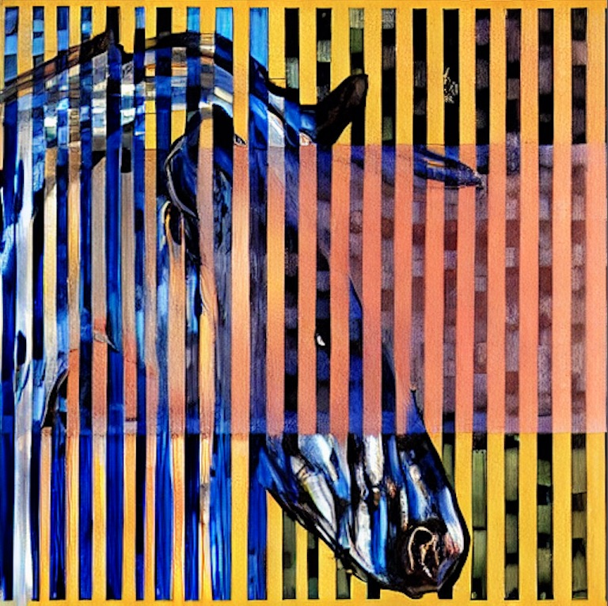

# Stable Diffusion Experiments

Output from collaborative experiments with visual artists. Also notes taken while working through an intro to machine learning course.

[stable diffusion notes](/assets/general-notes)

---

## Image Set 1...

(for above image → prompt = "blue horses grazing by &lt;artist&gt;")

Collaboration with a visual artist using fine-tuning to train stable diffusion model to recognize and emulate the style of the artist's paintings. Fine-tuning training was only given six examples of the artist's work. 
* [favorite output images](/assets/image-set-1/favorite-output-images.md)
* [all output images](/assets/image-set-1/all-output-images.md)
* [training images](/assets/image-set-1/training-images.md)

The results (thankfully) were not indistinguishable facsimiles of the artist's work but instead seemed to lean towards being compelling extensions / explorations / insights into the artist's work. The artist's impression was extremely positive and indicated that the images were going to play a valuable tool in the artist's studio practice / art production process.
